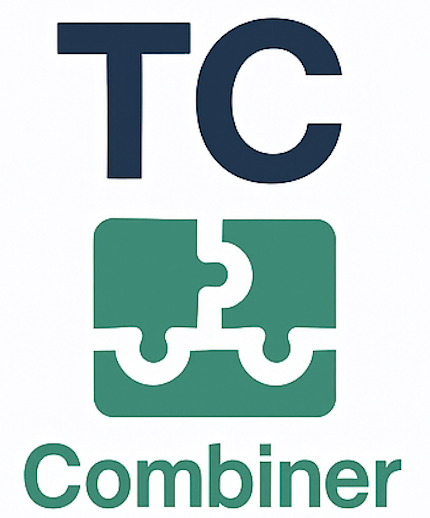

# TestCombiner

**TestCombiner** is the hardware pillar of the TC-Platform: a modular, extensible instrument platform that enables easy integration, control, and automation of various measurement and control modules.

---

## Key Features

- **Modular hardware architecture** (expandable, swappable instrument modules)
- **AVR/XMEGA/ARM-based controllers** (e.g., XMEGA32A4U, ATMEGA2560, Raspberry Pi plugin)
- **USB, UART, LAN (WIZNET W5500), WiFi (via RPi)** communication
- **SCPI/JSON protocol support** (PyVISA compatible)
- **Integration of custom and 3rd party instruments**
- **Open source firmware and hardware documentation**
- **Centralized data collection to InfluxDB**

---

## Documentation

- [TC-Platform main repo](https://github.com/Horikari/TC-Platform) – ecosystem, architecture, branding, integrations
- [TestComposer](https://github.com/Horikari/TestComposer) – software control, sequencing, GUI
- [TestCube](https://github.com/Horikari/TestCube) – expandable fixture and plugin system

---

## Contributing

Ideas, bug reports, pull requests, and forks are **welcome from everyone!**

---

## License

This project is licensed under the MIT License.  
See: [LICENSE](LICENSE)

---

© 2025 Horikari
